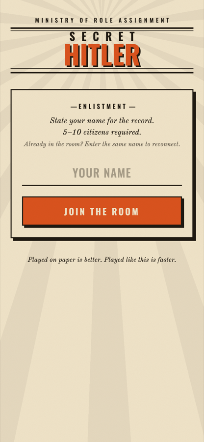
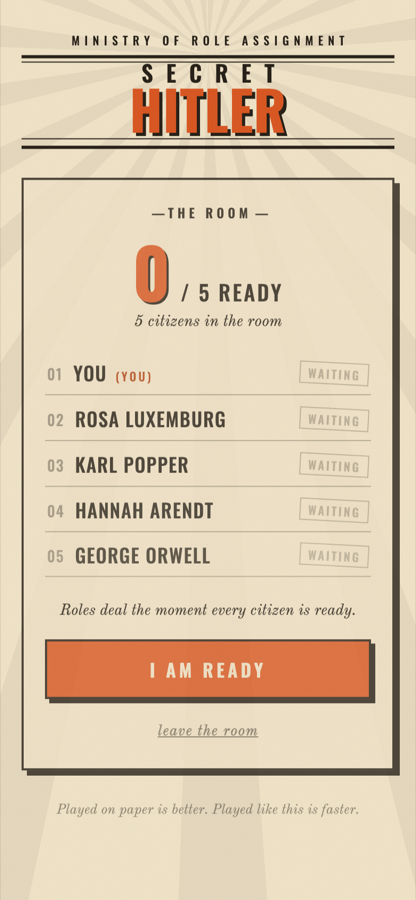
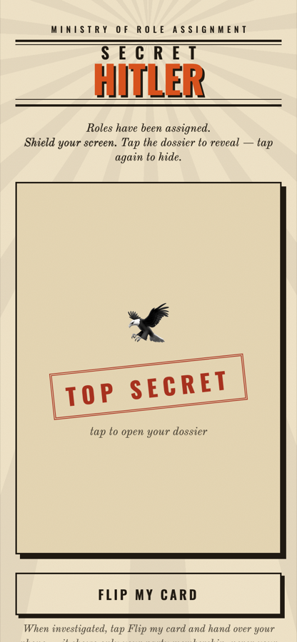
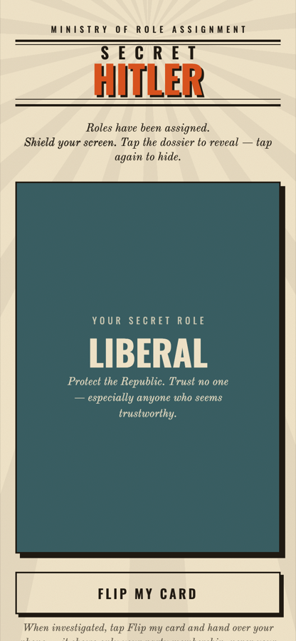
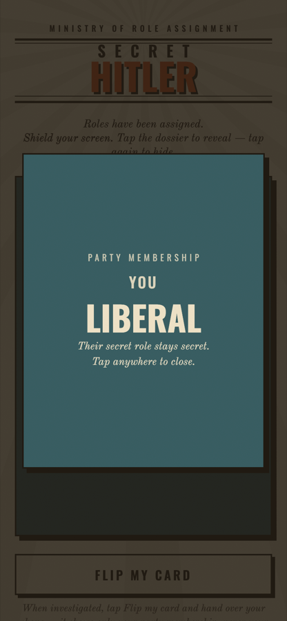

# Secret Hitler — Role Dealer

A zero-dependency, phone-based role dealer for [Secret Hitler](https://www.secrethitler.com/). Skip the paper cards: everyone joins a shared room on their own phone over Wi-Fi, and when the whole table is ready, roles are dealt and each player gets a private "top secret" dossier only they can see.

Built as a single Python script with no external dependencies (standard library only) and a single static HTML page — no build step, no install.

## How it works

1. One person runs `server.py` on their laptop.
2. Everyone else on the same Wi-Fi network opens the printed `http://<ip>:8000` URL on their phone.
3. Each player enters their name and joins the room.
4. Once 5–10 players have all marked themselves ready, roles are dealt automatically — liberals, fascists, and one Hitler, following the standard Secret Hitler player-count composition.
5. Each player taps their own phone to privately reveal their role. Fascists also see who their fellow fascists and Hitler are.
6. During the round, a player can hand their phone to another player and tap **Flip my card** — this reveals only their *party membership* (liberal/fascist), never their secret role, matching how in-person investigations work.
7. The round ends once every player votes **End game**, and the room resets to the lobby for the next round.

## Running it

```bash
python3 server.py
```

The server prints a LAN URL (e.g. `http://192.168.1.42:8000`) for players to open on their phones. Stop it with `Ctrl+C`.

## Screenshots

| Enlistment | The Room (lobby) |
|---|---|
|  |  |

| Dossier (hidden) | Role revealed |
|---|---|
|  |  |

| Investigation (party membership only) |
|---|
|  |

## Design notes

- **No dependencies.** The server uses only Python's standard library (`http.server`, `threading`, `json`); the client is a single `index.html` with no JS framework.
- **In-memory state.** Player roster and roles live in server memory behind a lock — there's no database, and everything resets when the process restarts.
- **Reconnect-friendly.** Closing and reopening the page reconnects to the same seat using a token stored in `localStorage`; entering your exact name again reclaims your seat from a new device.
- **Player composition** follows the standard rules:

  | Players | Liberals | Fascists (+ Hitler) |
  |---|---|---|
  | 5 | 3 | 1 |
  | 6 | 4 | 1 |
  | 7 | 4 | 2 |
  | 8 | 5 | 2 |
  | 9 | 6 | 2 |
  | 10 | 6 | 3 |
